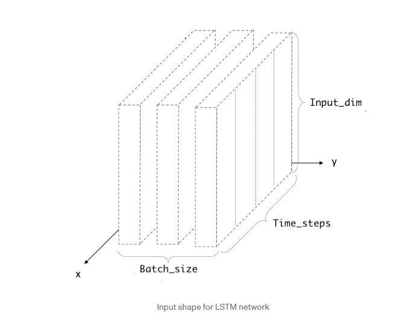

Research Notes

Long Short-Term Memory Neural Network (LSTM) 
============================================ 
- Data from:
    - https://www.researchgate.net/profile/Murtaza-Roondiwala/publication/327967988_Predicting_Stock_Prices_Using_LSTM/links/5bafbe6692851ca9ed30ceb9/Predicting-Stock-Prices-Using-LSTM.pdf
    
* seems very popular
* Features Extracted
    * Date
    * Open
    * Close
    * High
    * Low
    * Close
    * Volume
* Their method had 5 stages 
* ** let me know what you think of the features after reading this: ** [Article about relivent Features](https://shorturl.at/qCPQT)
    * this model has really good results
    
* These models are able to effectively associate memories and imput over time
* Testing data should only be 5-10% of all the collected data

* Feature choice: 
    * closing price 
    * https://www.simple-stock-trading.com/why-is-a-stock-close-price-more-important-than-high-or-low-in-chart-analysis/
    * volume 
    * https://smartasset.com/financial-advisor/high-volume-stocks
* From what I could read dtheir models tended to extract certain sets of features never choosing all. The one with coding only going with opening prices. Maybe we could just do these two? From my knowledge and a bit of digging found this.
* also for the time, it might just be easier to not include it. Since our data is already linear the data at the start will contain value of past time anyway with bias. 


Data Cleaning 
=============
* https://indicodata.ai/blog/should-we-remove-duplicates-ask-slater/

* More to elude to removing redundat trends. I don't know how hard it would be but maybe a htought for compaision on accuracy to see if including the repetiative patterns have a positive or negative impact 
    - not sure we want to remove redundent trends but rather redudent input values 

* After reading some papers I think it would be a good idea to just used closing data in the model because we can then predict the closing price and compare to the opening price to see 
    if its a good idea to invest

* Have a 3D input size: 
    * in the form of (batch_size, time_steps, units)
* 

* batch size refers to number of data points being processed at one time without update to weights
* in our example 1 hour is a data point and 32 data points would be a batch if the batch size was 32

* time steps refer to the sequential length of the data
* for example if we had 6 hours of data, then the time step would be 6 and our input would look like
    * [d0, d1, d2, d3, d4, d5] 
        - 6 sequential steps of data in reference to time
    * We have alot of data and 6 steps is relativley low, unless we do some cleaning of data maybe increase the amount ? idk

* input_dim refers to the actual input we have like open_value, close_value, and volume
    * we need to decide on which data to put into the model


* Training labels
- WTF we doing lol 
- So my current idea is to have 24 time steps and then the label would be the price that we are expecting on hour 25 (hour 25's closing price)


Neural Network with Keras
=========================
    
``` python:
model = Sequential()
model.add(LSTM(128, input_shape=(layers[1], layers[0]), return_sequences=True))
model.add(LSTM(64, input_shape=(layers[1], layers[0]), return_sequences=False))
model.add(Dense(16,init='uniform',activation='relu'))
model.add(Dense(1,init='uniform',activation='linear'))
```

* seems that around 500 epochs is a good number for incorperating all the mentioned parameters

- Another Link
    - Need IEEE access to view
    - https://ieeexplore.ieee.org/abstract/document/7966019

* Data does not only flow in one direction
* Neurons can pass data into a previous layer or the same layer

- Here is a good link with code examples
    - https://colab.research.google.com/drive/18WiSw1K0BW3jOKO56vxn11Fo9IyOuRjh#scrollTo=VU6ve06iDV5Q

- Helpful Explanations
    - https://colah.github.io/posts/2015-08-Understanding-LSTMs/
    
